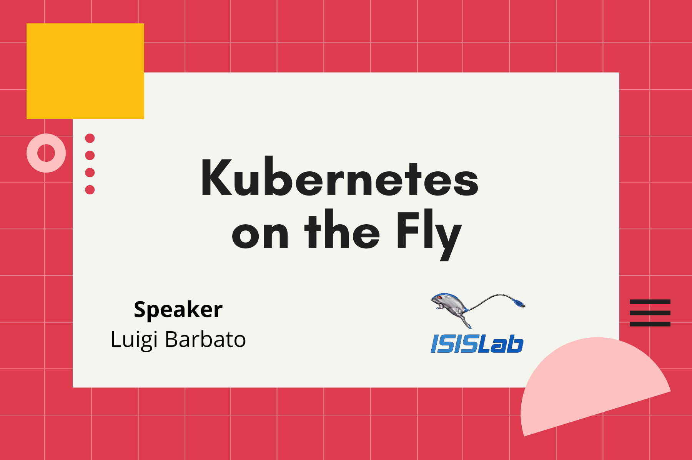

# Kubernetes on the Fly

## Abstract

### *Kubernetes è un software open-source che consente di gestire ed automatizzare con efficienza cluster di nodi su cui vengono eseguiti applicativi tramite la tecnologia di containerizzazione. Kubernetes consente di superare molte delle difficoltà legate alla gestione di numerosi container, agli elevati carichi di lavoro fornendo i servizi necessari per la rete e l'archiviazione. Nonostante i vantaggi rimane un sistema estremamente complesso ed articolato sia da gestire che da implementare all'interno di un'architettura più complessa. Fly è un linguaggio di programmazione domain-specific incentrato sul calcolo scientifico che permette di utilizzare servizi di cloud computing in modo semplice ed efficiente. L'obiettivo di questo lavoro di tesi è di introdurre all'interno di Fly un ambiente di esecuzione basato su Kubernetes, permettendo l'esecuzione del cluster sia in locale che su cloud. l'intero processo di esecuzione viene automatizzato grazie a costrutti Fly appositamente sviluppati per semplificare il lavoro dello sviluppatore.*

---
## Links
- [@ISISLab](https://www.isislab.it/): the ISISLab laboratory of the Department of Computer Science  of University of Salerno (Italy), since 1995 deals with three research topics:  Distributed and Parallel Computations (Cloud and Edge Computing, Massive simulations, Parallel algorithms and architectures), Collaborative and Social Calculation (Co-creation of Open Data, Collaborative design, Synchronous and co-located collaboration, Privacy, Adaptive and customized systems) and Visualization and Interaction (Scalable Display, Virtual Reality Applications, Innovative interfaces)
- [@FLY-Language](https://github.com/fly-language): FLY is a parallel work-flow scripting imperative language inspired by functional languages peculiarities. FLY uses two type of run-time environment: the local machine and/or cloud infrastructure. FLY perceives a cloud computing infrastructure as a parallel computing architecture on which it is possible to execute some parts of its execution flow in parallel.
