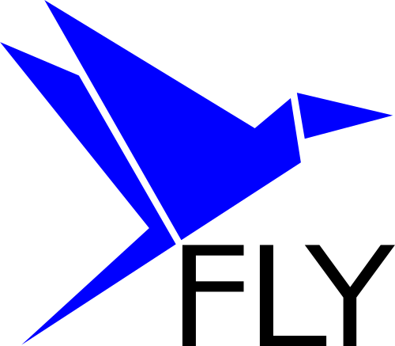

## Scalabile, veloce, funzionale
Fly sfrutta la potenza computazionale offerta dal Cloud Computing attraverso il paradigma FaaS, Function as a Service, che permette di ottenere alta scalabilità ed alte prestazioni.

<!-- block-start: grid -->
<!-- block-start: column,left -->

<!-- block-end -->
<!-- block-start: column -->

<!-- block-end -->

<!-- block-end -->

---
## Limitazioni del Serverless Computing 😔
<!-- section-title: Obiettivi di integrazione del sistema Kubernetes -->

- Tempi di esecuzione limitati (es. 15 minuti *AWS*)
- Dimensione della memoria limitata
- Mancanza di controllo sull'ambiente di esecuzione