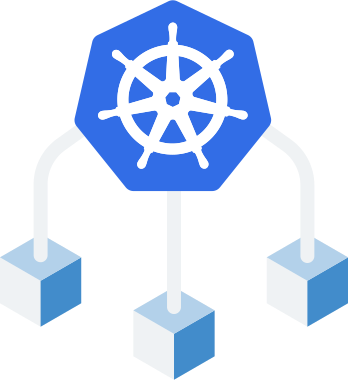

<!-- section-title: Vantaggi di Kubernetes -->
## Orchestrazione di Kubernetes
L'orchestrazione di Kubernetes consente di creare servizi applicativi che si estendono su più container in un cluster, automatizzandone la gestione, la scalabilità e l'integrità nel tempo.
<!-- block-start: grid -->

<!-- block-start: column,left -->

<!-- block-end -->

<!-- block-start: column -->

- `Master node`: la macchina che controlla i nodi Kubernetes. È il punto di origine di tutte le attività assegnate.

- `Pod`: un gruppo di uno o più container. I pod astraggono la rete e lo storage dal container sottostante, consentendoti di spostare i container nei cluster con maggiore facilità.

- `Replica Set`: controlla il numero di copie identiche di un pod che devono essere eseguite e gestite.

<!-- block-end -->

<!-- block-end -->

---

## Orchestrazione di Kubernetes
L'orchestrazione di Kubernetes consente di creare servizi applicativi che si estendono su più container in un cluster, automatizzandone la gestione, la scalabilità e l'integrità nel tempo.
<!-- block-start: grid -->

<!-- block-start: column,left -->

<!-- block-end -->

<!-- block-start: column -->

- `Servizio`: disaccoppia le definizioni del lavoro dai pod. indirizzando ogni richiesta al pod corretto, indipendentemente dalla sua posizione.

- `Kubelet`: questo servizio viene eseguito sui nodi, legge i manifest del container e garantisce che i container definiti vengano avviati ed eseguiti.

- `kubectl`: lo strumento di configurazione della riga di comando di Kubernetes.

<!-- block-end -->

<!-- block-end -->

---
## Architettura

---

## Cosa non è Kubernetes

- Non limita i tipi di applicazioni supportate
- Non compila il codice sorgente e non crea i container
- Non impone soluzioni di logging, monitoraggio o di gestione degli alert
- Non fornisce né rende obbligatorio un linguaggio/sistema di configurazione