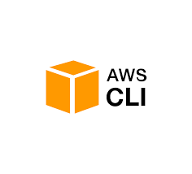

<!-- section-title: Implementazione e lavoro di tesi -->

# Implementazione
## Tecnologie utilizzate
<!-- block-start: grid -->
<br></br>
<br></br>
<br></br>

<!-- block-start: column -->




<!-- block-end -->
<!-- block-end -->

---
# Implementazione
## Workflow


---

# Implementazione
## Workflow


---

## Codice FLY
```shell
# Computazione del pi greco
var cloud= [type="azure", language="nodejs", threads=100]

var cluster = [type="k8s",clusterName="Fly",registryName="FlyRegistry.azurecr.io"] on cloud 
                      
var ch = [type="channel"] on cloud

func pi(){	     
   var r = [type="random"]   
   var x = r.nextDouble()          
   var y = r.nextDouble()                  
   var msg = 0  
   if((x * x)+(y * y) < 1.0){msg = 1}             
   ch!msg on cluster
}  
func estimation(){
var sum = 0
var crt = 0
for i in [0:100] {
      sum += ch? as Integer
  crt += 1
}
println "pi estimation: " + (sum*4.0) / crt
}

fly pi in [0:100] on cluster thenall estimation
```

---

## File JS Generato
```javascript
let redis = require('redis'), client = redis.createClient({port:6379,host:'redis'});
var x = Math.random()
var y = Math.random()
var msg = 0
if((x * x) + (y * y) < 1.0)
    {
        msg = 1 
    }
client.on('ready', function (err) {
client.rpush('queue:jobs',msg)});
```

---

## Dockerfile Generato
```yaml
FROM node:10
MAINTAINER Luigi Barbato <l.barbato11@studenti.unisa.it>
EXPOSE 8888
WORKDIR /function
COPY ./main.js .
RUN npm install redis
CMD ["node", "main.js"]
```
---
## File di deployment di Kubernetes
```yaml
apiVersion: batch/v1
kind: Job
metadata:
  name: fly-job
spec:
  parallelism: ${parallelism}
  completions: ${completions}
  ttlSecondsAfterFinished: 5
  template:
    metadata:
      name: fly
      labels:
        jobgroup: fly
    spec:
      containers:
        - name: fly-node
          image: ${registryName}/fly_node
          command: [ "node", "./main.js" ]
      restartPolicy: Never
```

---
## Servizio Redis e  Load Balancer
```yaml
apiVersion: v1
kind: Service
metadata:
  name: redis
spec:
  ports:
    - port: 6379
      targetPort: 6379
  selector:
    app: redis
```

```yaml
apiVersion: v1
kind: Service
metadata:
  name: public-svc
spec:
  type: LoadBalancer
  ports:
  - port: 6379
  selector:
    app: redis
```