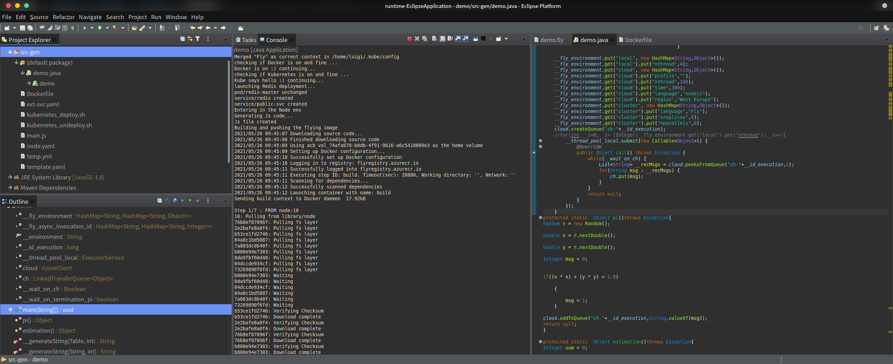
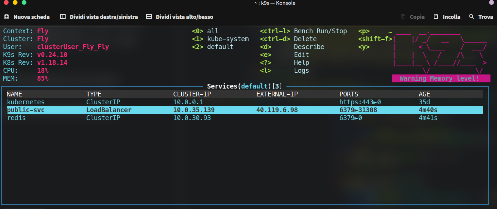
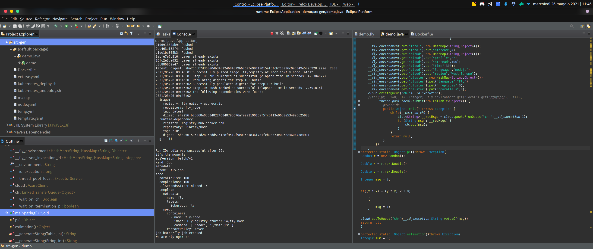
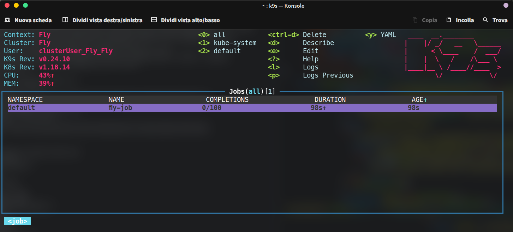
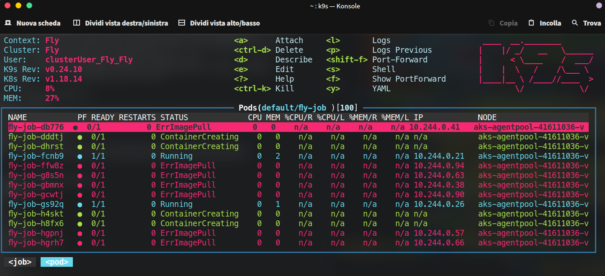
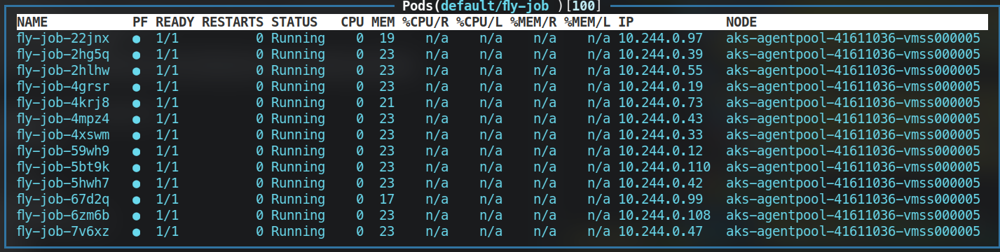
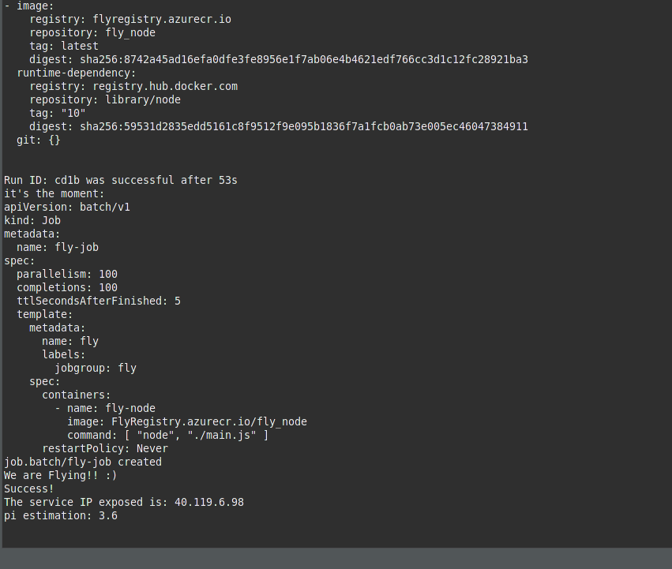

# Implementazione
## Dimostrazione: Esecuzione

---

# Implementazione
## Dimostrazione: Redis Master & Servizi

---

# Implementazione
## Dimostrazione: Esecuzione Job

---

# Implementazione
## Dimostrazione: Job Running

---

# Implementazione
## Dimostrazione: Job Running - Gestione Failures

---

# Implementazione
## Dimostrazione: Job Running - Pods Success

---

# Implementazione
## Dimostrazione: Pi Estimation
